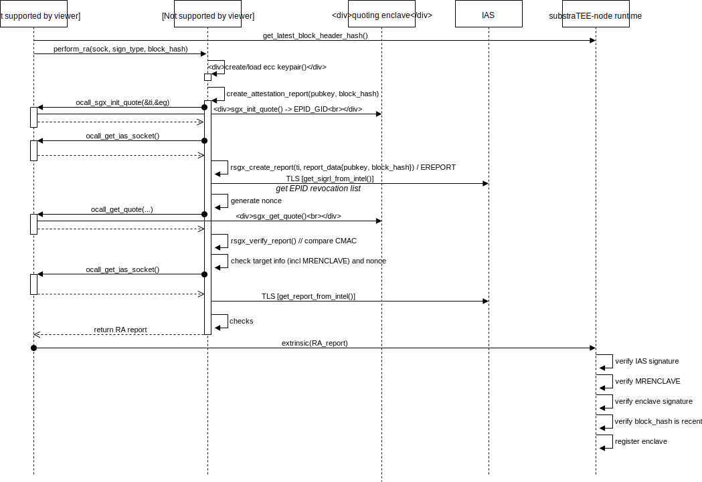

# Attestation

The goal of attestation is to convince a third party that a specific piece of code is running on a genuine Intel SGX HW.


## convincing the substraTEE user

A user that interacts with substraTEE wants to be sure that the shielding pubkey she uses to encrypt her call to the STF originates form an enclave that

   1. is running on genuine Intel SGX HW
   1. runs the official code
   1. accesses the correct STF state

### Classical Remote Attestation Solution

The standard use case for remote attestation involves a service provider (SP) like a video streaming service which wants to be sure his viewer application runs on a genuine SGX HW and respects DRM.
The SP therefore requests a quote from the application and sends that quote to Intel Attestation Services (IAS) who sign off the quote if it is genuine.

The issue here is that IAS only talks to registered clients. You need to register in order to get a SPID which needs to be supplied along with requests.

### Attestation Registry On-Chain

It isn't practical to ask every client to register with Intel and perform RA before every request. Therefore we'd rather let the substraTEE-worker operators attest their enclaves with IAS and write the signed quote and their certificate to the blockchain for everyone to verify.

This does change the the attestation protocol. Now the SP and the enclave in the above scheme are both running on the same machine. substraTEE-worker will itself perform an attestation protocol with its enclave and get the quote signed by IAS. Like this, only substraTEE operators need to register with IAS.



The attestation report which is written to an on-chain registry contains:
* enclave quote
   * report body
      * MRENCLAVE (hash of enclave build)
      * Product ID (hard-coded in substraTEE source)
      * Security Version (hard-coded in substraTEE source)
      * user data is hash of context:
         * enclave-individual signing pubkey
         * latest block hash
   * ...
* IAS response
   * body
      * status (OK||CONFIGURATION_NEEDED|GROUP_REVOKED....)
      * timestamp
      * enclave quote
      * ...
   * IAS certificate 
   * IAS signature over above body

Any user can now verify IAS signature and MRENCLAVE (given the substraTEE enclave can be build deterministically). See the [example](https://github.com/rodolfoams/sgx-retrieve-identity/blob/5be913b96b2a6e5a0e1158ad169b977507291faa/Makefile#L253) how you can extract MRENCLAVE after building the enclave

The worker can now publish his sealing pubkey, signed with its enclave-individual signing key stated in the quote.

workers will repeat remote attestation in reasonable regular intervals (i.e. once per month)

### Enclave Registry On-Chain
In order for the chain validator to be able to verify MRENCLAVE, there must be a consensus about MRENCLAVE of the valid version of substraTEE.

substraTEE developers will propose code updates to be voted on. Validators check the code and 
vote on behalf or against each proposal. MRENCLAVE can be reproduced by cloning the substraTEE-worker repo, building it and then:
```
sgx_sign dump -enclave enclave.signed.so -dumpfile out.log
```

TODO: we might need to provide a docker environment the achieve deterministic builds.

## secret provisioning

In order to establish shared secrets among workers, they need to convince themselves mutually that they are genuine before entering some *Distributed Key Generation* (DKG) protocol.


## Sealing

provisioned secrets are sealed with Intel's [SGX Sealing](https://software.intel.com/en-us/blogs/2016/05/04/introduction-to-intel-sgx-sealing). Two different kinds of sealing exist. MRENCLAVE is unique for each build and each piece of HW. MRSIGNER is based on the authority of a SW vendor. The latter is practical for proprietary software because vendors can update their SW without re-provisioning secrets.

However, for decentralized open source projects, MRSIGNER cannot apply as there is no authority that could sign builds.

Therefore, *enclave identity* MRSIGNER must be applied.

### SW updates
As SW updates will have a different measurement, the new build can't read the state that was encrypted by the old build. Local attestation allows the new version to request the provisioned secrets. 

We assume reproducible builds for enclaves which should be possible with Rust subject to  some assumptions. For now, watch [this issue](https://github.com/rust-lang/rust/issues/34902) and [cargo-repro](https://github.com/rust-secure-code/cargo-repro).

Simplified Protocol
1. new version's TCB hash gets voted for by onchain consensus
1. new version registers its attestation on-chain
1. old version shares provisioned secret with new version running on same machine by means of local (intra-platform) attestation if new version's tcb corresponds to onchain registry

See [Intel's sealing paper](https://software.intel.com/en-us/articles/innovative-technology-for-cpu-based-attestation-and-sealing)

## IAS

Intel [defines different modes](https://software.intel.com/en-us/blogs/2016/01/07/intel-sgx-debug-production-prelease-whats-the-difference) for running enclaves.

compilation modes: *Debug*, *Release*, *Pre-Release*, *Simulation*
lanching modes: *Debug*, *Production*

### EPID 
Enhanced Privacy ID (EPID). A group signature key known only to the quoting enclave. Only used for remote attestation.

### SPID
A Service Provider ID (SPID) is needed to talk to IAS. Developers can obtain their SPID by [registering with Intel](https://software.intel.com/en-us/form/sgx-onboarding) (only allows to attest DEBUG encalves!)

You can request either *linkable* or *unlinkable* quote. 

**tl;dr**: selecting UNLINKABLE is a safe choice. But don't expect to be anonymous.

In both cases, the quoting enclave uses a group signature for a quote. You can just decide if you wish two subsequent signatures to be linkable (an observer learns "quote was signed by same platform") or not.

In any case, Intel can identify YOU by SSID as you use your SSID for remote attestation with IAS. It just doesn't learn about which HW platform the quote originates from.

### Production vs. Debug Mode

Due to Intel policy, developers can only compile enclaves in *Debug*, *Pre-Release* or *Simulation* mode. This means that the enclave will always be launched in *Debug* mode which doesn't provide confidentiality as enclave memory isn't encrypted.

In order to compile enclaves in *Release* mode (and run them in *Production* mode), the SW vendor has to apply for a SGX production license. 
Moreover, remote attestation in production mode can only be taken out with such production license.

*SCS is looking into options how to apply such policy to a decentralized system with Intel.*

**solution candidate**
1. A set of *companies* (i.e. SCS, web3 foundation) register a production license with Intel
1. substraTEE-workers send their RA quotes to the chain.
1. the *company* listens to new RA quotes and sends them to IAS with the *company's* SPID.
1. the *company* sends the IAS report to the chain.

## Literature
chaotic list of pointers:

* [review of SGX PSE for monotonic counters and trusted time](https://davejingtian.org/2017/11/10/some-notes-on-the-monotonic-counter-in-intel-sgx-and-me/)
