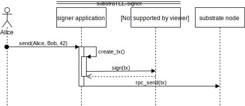
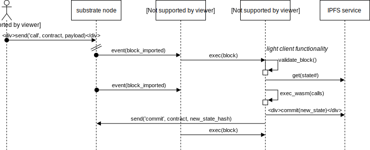

# substraTEE-doc
documentation for substraTEE, an extension of [parity substrate](https://github.com/paritytech/substrate) allowing to leverage Trusted Execution Environments (TEEs) to provide integrity and confidentiality

# Different ways to leverage TEEs

| use case | substraTEE-signer  (off-chain stateless) | substraTEE-worker  (off-chain stateful) | substraTEE-node  (onchain-stateful) |
|----------|-------------------|----------------|-----------------|
|hardware wallet| :+1: local TEE per user | | :thumbsdown:|
|atomic swaps (cross-chain bridge)| :+1: light node in both chains | :+1: | :thumbsdown: |
|coinmixer| :+1:  | :thumbsdown: | :thumbsdown: |
|oracle| :+1: | :+1: | difficult if non-deterministic |
|inheritance notary| :+1: | :+1: | storage expensive |
|confidential transactions| :thumbsdown: | :thumbsdown: doesn't scale? (collisions of state changes) | :+1: [encointer](https://encointer.org) |
| 2nd layer confidential payment hub (Similar to [TeeChan](https://github.com/lsds/Teechain))|  | :+1: | |
|confidential smart contracts |:thumbsdown: | :+1: (Ekiden, PDO, [encointer](https://encointer.org)) | computation time and storage expensive|
| [POET](https://sawtooth.hyperledger.org/docs/core/releases/1.0/architecture/poet.html) consensus | :thumbsdown: | :thumbsdown: | :thumbsdown: |

# substraTEE-signer
*off-chain*: nothing special needs to be run by blockchain validators. normal transactions

*stateless*: no state needs to be preserved (onchain - data or hash) between uses

One flavour of substraTEE is a RPC client for substrate that runs a state transition function (STF) within a TEE (Intel SGX). 

Main feature: trusted hardware custodian of your private keys

# substraTEE worker
*off-chain*: nothing special needs to be run by blockchain validators. normal transactions

*stateful*: state needs to be preserved (onchain - data or hash) between uses

Similar to but still quite different than [sawtooth PDO](https://github.com/hyperledger-labs/private-data-objects) or [Ekiden/OasisLabs](https://www.oasislabs.com/)

*Do not confuse substraTEE-worker with substrate's [off-chain workers](https://github.com/paritytech/substrate/pull/1942). The latter are a part of the node's codebase. SubstraTEE worker is a standalone service interfacing substrate node using RPC or websockets* 

Dapps can commit WASM contracts and run their own TEE's or hire an enclave service to run confidential WASM smart contracts on. delegates are remote attested on the blockchain (the TCB doesn't include the WASM contract). They have to be fed with the most recent state, call and opaque payload. They then update the state that is written back to the chain.

# substraTEE-stealth-node
*on-chain*: blockchain validators run confidential state transition function with every extrinsic. 

*stateful*: state needs to be preserved (onchain - data or hash) between uses

a fork of substrate that has an Executor running in a TEE (Intel SGX)

Main feature: many confidential transactions can be executed with every block

