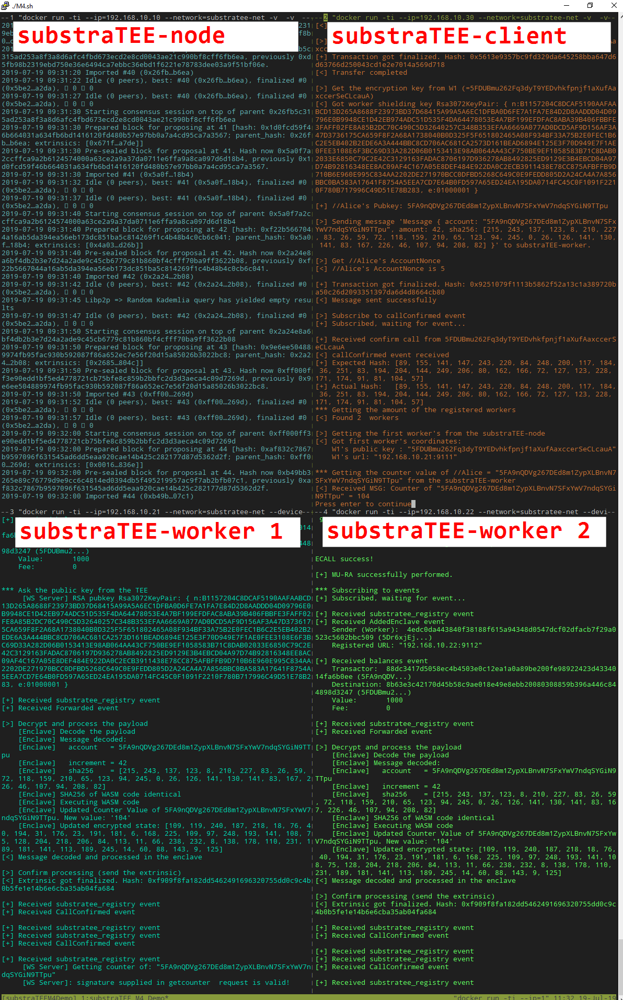

### M4 Redundancy and Secret Provisioning
The M4 demo differs from the proposed architecture in the following points:
- There is only one docker image that contains the substraTEE-node, the substraTEE-worker and the substraTEE-client (named _substratee_)
- There will be 4 docker containers running the following components:
  - Docker container 1: substraTEE-node
  - Docker container 2: substraTEE-client
  - Docker container 3: substraTEE-worker 1
  - Docker container 4: substraTEE-worker 2
- The substraTEE-node has only one module (called substratee-registry module) that includes all the required functionality
- The substraTEE-client not only talks to the substraTEE-node, but also communicates directly with the substraTEE-worker (in order to get the shielding key)
- The encrypted state is exchanged between the two substraTEE-workers by the use of IPFS (https://ipfs.io)

The following requirements are needed to run the M4 demo:
* Intel SGX installed, enabled and working (see https://github.com/intel/linux-sgx)
* Intel account information for Remote Attestion. These files (`key.txt` and `spid.txt`) must be placed in the folder `intel_cert`
* Docker installed
* Tmux installed
* Active internet connection

To build and execute the code, follow these instructions:
1. Clone the [substraTEE](https://github.com/scs/substraTEE) repository to your favorite location:
   ```shell
   $ git clone https://github.com/scs/substraTEE.git
   $ git checkout M4
   ```
2. Execute the shell script to build the docker image and start the containers:
   ```shell
   $ cd substraTEE
   $ ./M4.sh
   ```

The script performs the following steps:
1. Clone the `rust-sgx-sdk` repository into the direcotry `rust-sgx-sdk` as this is needed to execute the code in the docker containers.
2. Build the docker iamge `substratee` based on the `DockerfileM4` (setup Ubuntu 18.04, install the Intel SGX Linux SDK and drivers, compile the substraTEE components, installs IPFS, copy the required file to the Docker image).
3. Create a docker network so that the 4 containers can communicate with each other.
4. Setup a tmux session with 4 panes running the corresponding docker containers (see following screenshot):
   - Upper left: substraTEE-node
   - Upper right: substraTEE-client
   - Lower left: substraTEE-worker 1
   - Lower right: substraTEE-worker 2



#### Flow of the demo
- The **substraTEE-node** is started immediately in development mode and begins to generate blocks.
- The **substraTEE-worker 1** is started 3 seconds after the substraTEE-node and registers it's enclave at the substraTEE-node.
- The **substraTEE-client** is started 30 seconds after the substraTEE-node and performs a first transaction. As only one worker is registered, the substraTEE-worker 1 performs the state transition function.
- The **substraTEE-worker 2** is started 60 seconds after the substraTEE-node and registers it's enclave at the substraTEE-node. It detects that another enclave is already registered, performs a mutual remote attestation (MU-RA), exchanges the state encryption key and the encrypted state (over IPFS). At this point, two enclaves are registerd in the substraTEE-node.
- The **substraTEE-client** performs another transaction 30 seconds after the first. There are now two enclaves registered and both react on the transaction and calculate the new state.
- The **substraTEE-client** queries finally the counter from one of the workers which verifies the signature.

After the demo has run, the local directory `./output` contains the log files of the different components.