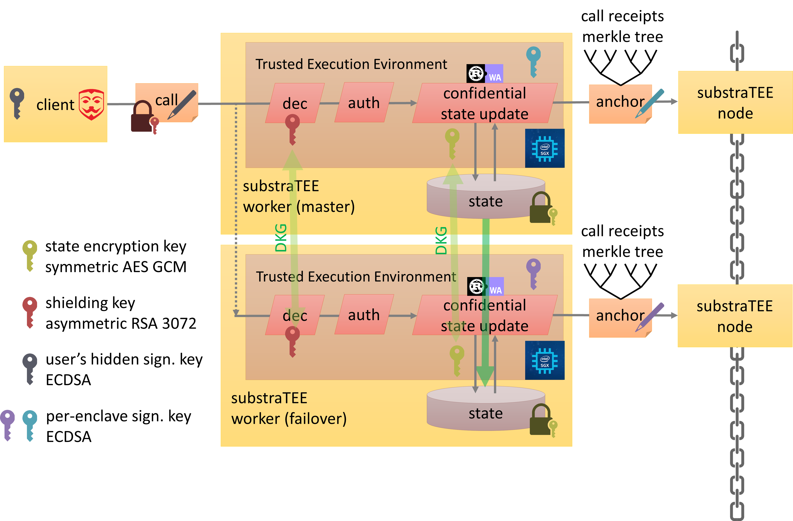
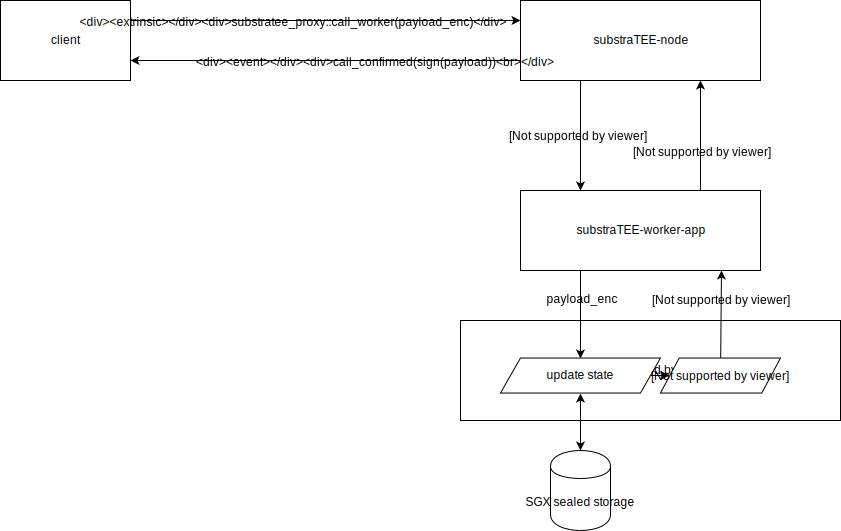
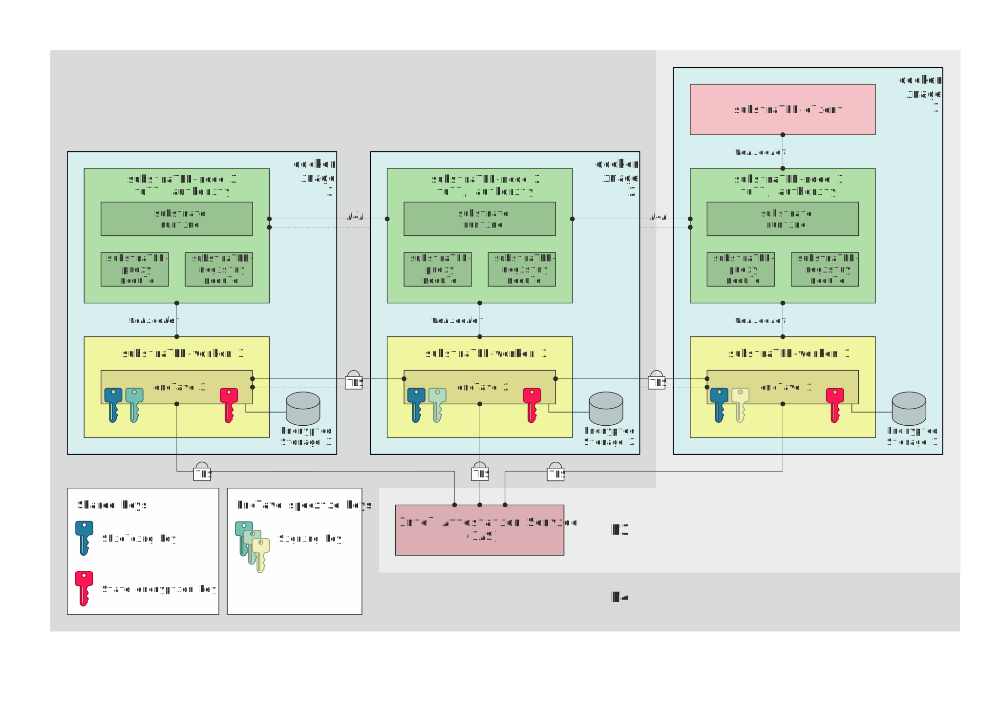

# substraTEE
<p align="center">

</p>

*please visit [www.substratee.com](https://www.substratee.com) for up to date information*

find our latest code in the following repos:

[scs/SubstraTEE-worker](https://github.com/scs/substraTEE-worker)

[scs/substraTEE-node](https://github.com/scs/substraTEE-node)

[scs/pallet-substratee-registry](https://github.com/scs/pallet-substratee-registry)


## OUTDATED:

*substraTEE* is an extension to [Parity Substrate](https://docs.substrate.dev/), allowing to call a custom state transition function (STF) inside a Trusted Execution Environment (TEE), namely an Intel SGX enclave thereby providing confidentiality and integrity. The enclaves operate on an encrypted state which can be read and written only by a set of provisioned and remote-attested enclaves.
*substraTEE* enables use cases demanding transaction privacy as well as atomic cross-chain transfers (bridges).


*SubstraTEE Target Architecture with Direct Invocation (future scenario)*

What substraTEE aims to provide:

* confidential decentralized state transition functions
  * private transactions
  * private smart contracts
  * off-chain confidential personal data records (GDPR)
* scalability by providing a 2nd layer to substrate-based blockchains
  * off-chain smart contracts
  * payment hubs
* trusted chain bridges
* trusted oracles

## Concept Study

Different use cases for TEE's and potential software architectures have been analyzed and compared in [CONCEPTS](./CONCEPTS.md).
In the following we'll refer to the *substraTEE-worker* architecture, which has been implemented because it supports the widest range of use cases.

An overview over security aspects can be found in [SECURITY](./SECURITY.md). Remote attestation deviates from the usual Intel SGX scenario and is presented in [ATTESTATION](./ATTESTATION.md)

## Roadmap

|    Milestone    	|    Request    Invocation    	|    STF                      	|    # Workers per STF    	|    On-chain tx per invocation    	|    read chain state from STF  | Supported TEE Manufact.                   	|  Remote Attestation Registry  |
|-----------------	|-----------------------------	|-----------------------------	|-------------------------	|----------------------------------	|----------------------------------------------	| ---|---|
|    M1 &#9745;          	|    Proxy                    	|    Rust                     	|    1                    	|    2                             	|   - 	|    Intel                                     	|   -  |
|    M2 &#9745;          	|    Proxy                    	|    Rust or WASM             	|    1                    	|    2                             	|   - 	|    Intel                                     	|  -  |
|    M3 &#9745;          	|    Proxy                    	|    Rust or WASM             	|    1                    	|    2                             	|   - 	|    Intel                                     	|  X  |
|    M4 &#9745;          	|    Proxy                    	|    Rust or WASM             	|    N (redundant)        	|    1+N                           	|   - 	|    Intel                                     	|  X  |
|    M5 &#9745;          	|    Proxy                    	|    Rust modular           	|    N (redundant)        	|    1+N                           	|   - 	|    Intel                                     	|  X  |
|    M6 &#9744;          	|    Proxy                    	|    Rust modular           	|    N (redundant)        	|    1+N                           	|   X 	|    Intel                                     	|  X  |
|    future &#9744;      	|    Proxy                    	|    Rust or **Ink**	|    N (redundant)        	|    2                             	|   X 	|    Intel + ARM TrustZone + Keystone   (?)    	|  X  |
|    future &#9744;       |    **Direct**               	|    Rust or **Ink**	|    N (master + failover)    	|    **<< 1**                	|   X 	|    Intel + ARM TrustZone + Keystone   (?)    	|  X  |


### M1 PoC1: single-TEE confidential state transition function
off-chain worker runs STF within an Intel SGX enclave. The state is persisted in a sealed file which can only be read by that very enclave.

The demo STF will be a simple counter.

### M2 PoC2: single-TEE confidential state transition function in WASM
In addition to M1, the STF is defined by WASM code which is run by a WASMI interpreter within an Intel SGX enclave.

The demo STF will be a simple counter.

### M3 Remote Attestation Registry

substraTEE-worker can remote-attest its own enclave with Intel Attestation Service (IAS). The report signed by IAS is then registered on-chain with substraTEE-registry runtime module. Users can verify a worker’s IAS report before interacting with it. So they can be certain that the correct code is running on a genuine SGX CPU.

### M4 Redundancy and Secret Provisioning

Several substraTEE-workers running on different machines can redundantly operate on the same STF. This guarantees that the STF survives the loss of a few SGX machines (going offline, breaking down, denial-of-service). Moreover, this improves integrity guarantees as all the workers register call receipts including the hash of the new state. A single compromised enclave can therefore only break confidentiality, but not integrity, as manipulation would be evident to anyone.
Secret sharing among a dynamic set of worker enclaves must be implemented for such redundancy.

### M5 Modular STF with private-tx example
Since M5, the STF is modular and has its own crate which can easily be swapped. An example for private transactions has been added

### M6 read chain state from STF
From M6 onwards, SubstraTEE STF can access chain state in a trustless way. A substrate light client verification logic will be included in the worker enclave that allows the STF to query chain state by means of subscribing to storage over RPC and verifying returned values within the enclave.

### *FUTURE*

#### support for ink contracts

*(development not yet funded)*

[ink!](https://medium.com/block-journal/introducing-substrate-smart-contracts-with-ink-d486289e2b59) is substrate's domain specific contract language on top of Rust. This milestone shall bring ink! contracts to substraTEE.

### other

* direct invocation
* performance benchmarks and optimization
* testnet for stress-tests and showcasing
* use cases: bridges, payment hubs, ...

## Indirect Invocation (M1-M5)

The high level architecture of the current implementation can be seen in the following diagram:



The main building blocks can be found in the following repositories:

* [substraTEE-node](https://github.com/scs/substraTEE-node): (custom substrate node) A substrate node with a custom runtime module
* [substraTEE-worker](https://github.com/scs/substraTEE-worker): (client, worker-app, worker-enclave): A SGX-enabled service that performs a confidential state-transition-function

## Redundancy (M3-M5)
The goal of redundancy is to allow multiple workers to operate on the same state to be resilient against outage of one or more workers.

The high level architecture of the proposed architecture for M3 and M4 can be seen in the following diagram:


where M3 includes only the *docker image 1* and the *Intel Attestation Service (IAS)* and M4 includes the three *docker images* and the *Intel Attestation Service (IAS)*.

### Terms
* Shielding key: used by the substraTEE-client to encrypt the call in order to protect caller privacy. It is common to all enclaves.
* State encryption key: used to encrypt and decrypt the state storage. It is common to all enclaves.
* Signing key: used to sign transactions for the substraTEE-node. The corresponding account must be funded in order to pay for chain fees. It is unique for every enclave.

### Description
The *substraTEE-node* includes two additional runtime modules:
* substraTEE-proxy module: It forwards encrypted payloads to substraTEE-worker (event based) and indicates the finalization of the transaction (event based). This is the same functionality as for M1 and M2.
* substraTEE-registry module: It checks the IAS reports and keeps track of the registered enclaves. It provides the following API interfaces:
  * Register an enclave
  * Remove an enclave
  * Get the list of enclaves

The *substraTEE-worker* checks on the first start-up if "his" enclave is already registered on the chain. If this is not the case, it requests a remote attestion from the Intel Attestation Service (IAS) and sends the report to the *substraTEE-registry module* to register his enclave. If there is already an enclave (p.ex. from a different substraTEE-worker) registered on the chain, the substraTEE-worker gives his enclave the address of (any of) the registered enclave(s) so that it can get the *shielding and state encryption private key* and the most recent *encrypted state storage*.
The remaining functionality of the *substraTEE-worker* stays the same as for M1 and M2 (get the encrypted payload, use the enclave to decode the payload and perform the STF in the enclave).

The exchange of critical information between the enclaves is performed over a secure connection (TLS). The two enclaves perform a mutual remote attestation before exchanging any secrets.

## Docker image for development
We provide a generic docker image that contains all required components to build and run the substraTEE components. This can be used for development or CI machines.

If you want to build the docker image yourself, use the following command:
```bash
./docker_build.sh
```

This script will define the desired versions of the components and build the Docker as described in the `Dockerfile`.

It also adds the current user to the docker. The docker will start by default with the `USER_ID` and `GROUP_ID` that executed the build afterwards. This takes care of permission issues on docker generated/modified files and it allows seamless editing on the host while building and running in the docker.

The following command mounts the current directory into docker and publishes the default ports of the binaries to the host:

```
docker run -it --mount "type=bind,src=$(pwd),dst=/opt/shared" --workdir /opt/shared  -p 9979:9944 -p 2079:2000 -p 3079:3443 scssubstratee/substratee_dev:1804-2.12-1.1.3-001-user-1000-group-1000 /bin/bash
```

Pre-built docker images are also available on [docker hub](https://hub.docker.com/repository/docker/scssubstratee/substratee_dev/tags). **Note:** The pre-built images will always run as root. Any files generated withing docker can only be changed with root access.

## Demo

This repo hosts docker files to showcase the milestones.

We started with M5 to upload the docker images to [docker hub](https://hub.docker.com). They can be found [here](https://hub.docker.com/r/scssubstratee/substratee).

The following demos are available:
  * [M1 Demo](./M1_DEMO.md) Private Counter
  * [M2 Demo](./M2_DEMO.md) Private Counter in WASM
  * [M4 Demo](./M4_DEMO.md) Redundancy with Private Counter
  * [M5 Demo](./M5_DEMO.md) Private Transactions

If you're impatient, [watch our M5 demo on youtube](https://youtu.be/UQysB3MpOuk)

#### Enabling SGX HW support
The demos are by default compiled for [Simulation Mode](https://software.intel.com/en-us/blogs/2016/05/30/usage-of-simulation-mode-in-sgx-enhanced-application) meaning that you don't need an actual SGX platform to run the example. This is specified in the `DockerfileM*` on line 99 (`SGX_MODE=SW make`). If you are on a platform that supports the SGX, you can enable HW support by:
  * Installing the Intel SGX Driver 2.5 and make sure that `/dev/isgx` appears
  * Start the docker with SGX device support:
    ```bash
    $ docker run -v $(pwd):/substraTEE/backup -ti --device /dev/isgx substratee
    ```
  * Start the aesm service inside the docker:
    ```bash
    root@<DOCKERID>:/# LD_LIBRARY_PATH=/opt/intel/libsgx-enclave-common/aesm /opt/intel/libsgx-enclave-common/aesm/aesm_service &
    ```
  * Compile the substraTEE-worker with HW support:
    ```bash
    root@<DOCKERID>:/substraTEE/substraTEE-worker-M1# make
    ```
  * Re-run the demos.

If you run the Hardware Mode on a platform that does not support SGX, you get the following error from the substraTEE-worker
```
*** Start the enclave
[2019-05-15T05:15:03Z ERROR substratee_worker::enclave_wrappers] [-] Init Enclave Failed SGX_ERROR_NO_DEVICE!
```


## Acknowledgements

The development of substraTEE is partly financed by [web3 foundation](https://web3.foundation/)'s grant programme.

We also thank the teams at

* [Parity Technologies](https://www.parity.io/) for building [substrate](https://github.com/paritytech/substrate) and supporting us during development.
* [Baidu's Rust-SGX-SDK](https://github.com/baidu/rust-sgx-sdk) for their very helpful support and contributions.
