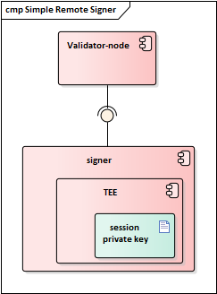
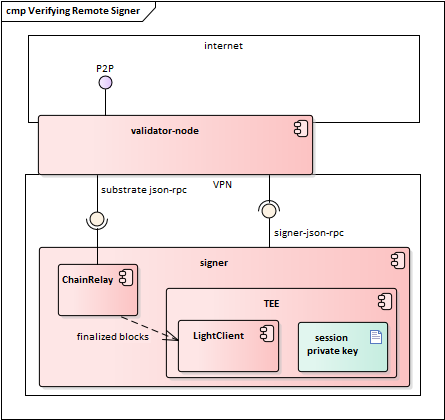
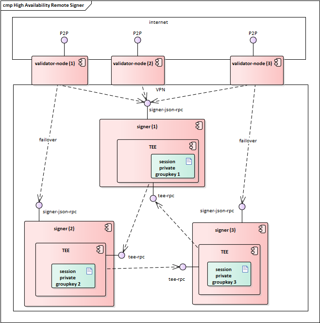
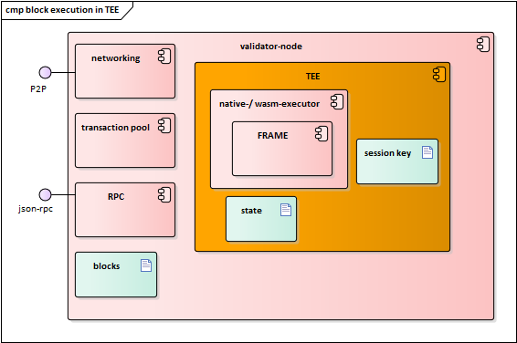

# Validator Protection Proposals

This document proposes different measures how NPOS blockchain validators can protect their session key and achieve high availability.

## Problem Statement

NPOS validators sign various messages with hot keys, the *session keys*. These messages can be related to consensus, such as GRANDPA finality votes or block authoring. These keys do not allow the transfer of any funds, but if the key is compromised, an attacker could hurt the validator by committing slashable behavior.

A second issue arises when the validator introduces redundancy in order to achieve high availability. The validator could run several validator nodes (all using the same session keys). This, however, could cause accidential double signing of two different block proposals, which would be punished by slashing.

Further, the session keys are not all necessarily of the same type. For example, one Substrate-based chain could have a set of session keys that include sr25519, ed25519, BLS12-381, or anything that has a verification implementation. Not all HSMs support such a variety of keys.

## Possible Solutions

### Simple Remote Signer

As a simple measure, the session key could be stored on a separate signer machine with hardened security. This would require substrate to support outsourcing the signing of block proposals.

The problem with this approach is that even if the private key would be well protected within a TEE or HSM, the signer would still sign whatever it is sent to sign, with no means to verify that the payload to be signed is legit. An attacker who gains the necessary privileges on the validator machine can still cause the validator to be slashed. While adding complexity, this approach does not improve security at all.

### Block-Verifying Remote Signer

We would like the signer to only sign valid block proposals. Validity means:

  1. the block proposal must be recent (link to the HEAD of the chain)
  2. all intrinsics and extrinsics in the block must be valid
  
Verifying the first condition could be done by integrating a light client into a signer TEE. The TEE would protect the session key. It would know what the most recent block header is and only sign off block proposals that fulfill the first condition. The integrity guarantees of the TEE would ensure that the session key is never used to sign an outdated or unrelated block proposal.

A light client can't easily validate intrinsics or extrinsics of block proposals because it has no knowledge of the FRAME code nor its externalities (state). It would have to query a full node for that and verify read proofs. Therefore, this approach is only partially satisfying.

### High Availability
High availability with protection against double-signing could be achieved by introducing a 2-of-3 multisignature scheme for remote signers:

sr25519 keys support signature aggregation, so we can introduce a multisig scheme which ensures that a **validator is available whenever 2 of his 3 signers and at least one validator node are**. This scheme also prevents double-signing.

Signer TEEs have to cooperate and therefore have to trust each other. Trust among signer TEEs can be achieved through mutual remote attestation.

Such an architecture would require substrate to support remote signing with failover signer URL's. 

We propose that signers expose a json-rpc interface that allows the validator node to send block proposals for signing.

### Running FRAME within a TEE

All remote signing schemes suffer from the fact that they can't validate the contents of a block proposal (intrinsics and extrinsics). A better approach than remote signing could be to modify substrate to optionally execute blocks within a TEE. 

This approach could be combined with the high-availability 2-of-3 proposal above.

### Replay Attack Mitigation

All above proposals based on TEEs may suffer from replay attacks. If the TEE features monotonic counters, that would enable a reasonable mitigation. If not, we could consider to implement a [ROTE](https://eprint.iacr.org/2017/048.pdf) protocol.

